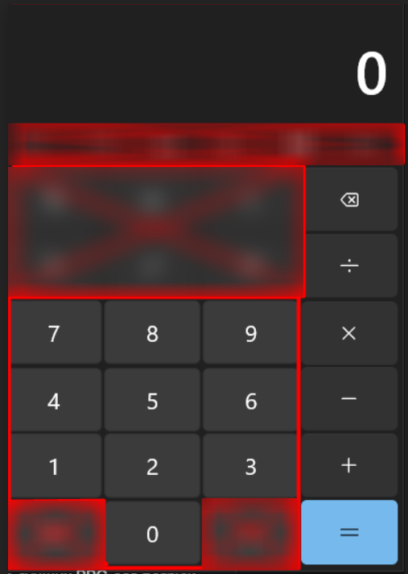

# JS calculator

Ещё один калькутор на JS)

## User Stories

### Версия 1.0 (текущая)

-   [x] Пользователь может вводить два числа в текстовые поля
-   [x] Пользователь может выбирать операцию из выпадающего списка
-   [x] Пользователь видит результат вычисления

### Версия 2.0 (в разработке)

-   [ ] Виртуальная клавиатура - кнопки цифр и операций, которые нажимаются с клавиатуры (или кликом мыши)
-   [ ] Визуальный дисплей как в Windows Calculator

### Версия 3.0 (планируется)

-   [ ] История вычислений
-   [ ] Поддержка ввода с клавиатуры
